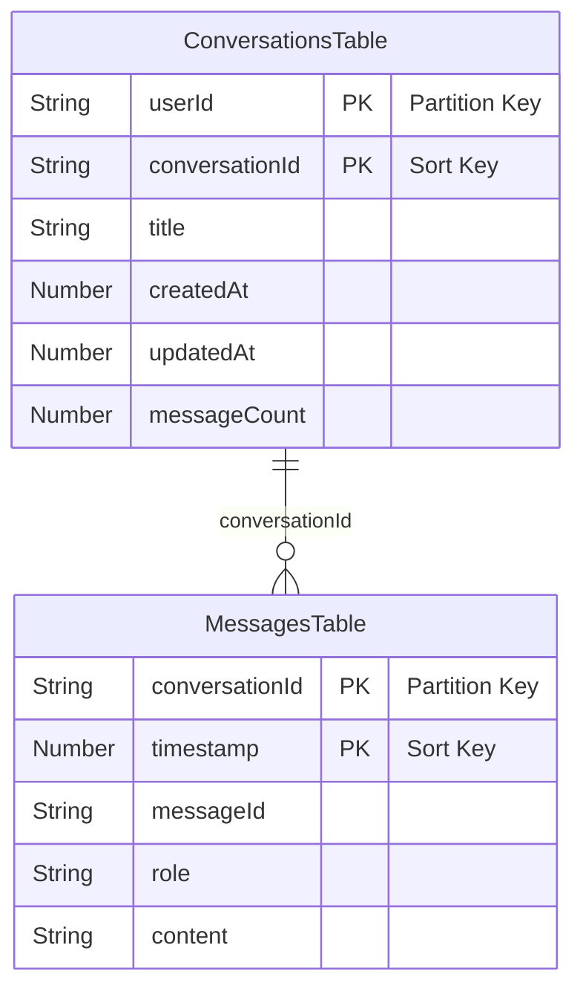
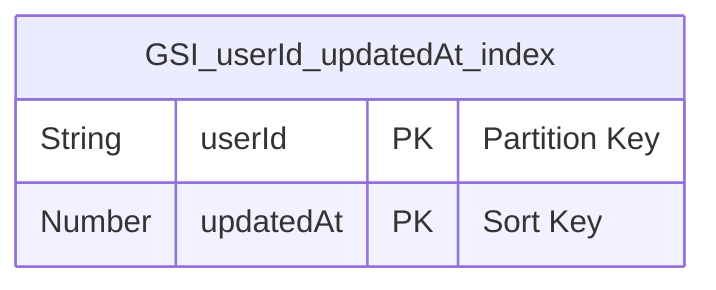

# DynamoDB テーブル設計

## ER図

## GSI（グローバルセカンダリインデックス）

## テーブル詳細

### ConversationsTable

| 属性 | 型 | キー | 説明 |
|------|------|------|------|
| userId | String | PK | Cognito ユーザーID（sub） |
| conversationId | String | SK | UUID v4 |
| title | String | - | メッセージ先頭50文字から生成 |
| createdAt | Number | - | 作成日時（Unix timestamp） |
| updatedAt | Number | - | 最終更新日時（Unix timestamp） |
| messageCount | Number | - | メッセージ数（user+assistantで+2ずつ加算） |

**GSI: userId-updatedAt-index**
- PK: `userId` (String)
- SK: `updatedAt` (Number)
- 用途: 会話一覧を更新日時の降順で取得

### MessagesTable

| 属性 | 型 | キー | 説明 |
|------|------|------|------|
| conversationId | String | PK | 会話ID |
| timestamp | Number | SK | Unix timestamp |
| messageId | String | - | UUID v4 |
| role | String | - | `user` または `assistant` |
| content | String | - | メッセージ本文 |

## 設定

- 課金モード: PAY_PER_REQUEST（オンデマンド）
- 削除ポリシー: DESTROY（開発用）
